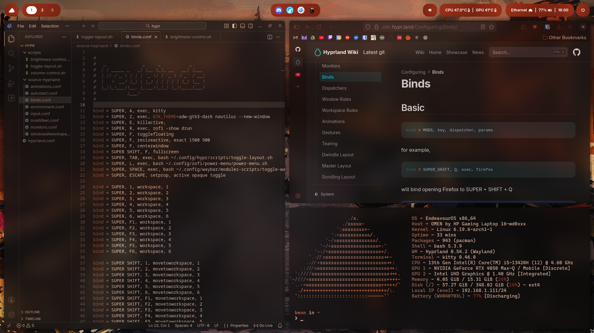

# Hyprland Configuration

<div align="left">




</div>

## Sommaire

- [Pré-requis](#Pré-requis)
- [Stack Utilisateur](#Stack-Utilisateur)
- [Installation des paquets](#Installation-des-paquets)
- [Arborescence](#Arborescence)

## Pré-requis

- **EndeavourOS** (Arch-based)
- Sans DE — **Hyprland** (Wayland) comme WM

## Stack utilisateur

###### Environnement

- Window Manager - [Hyprland](https://wiki.hyprland.org/)
- Fond d'écran - [Swww](https://github.com/LGFae/swww)
- Bar - [Waybar](https://wiki.archlinux.org/title/Waybar)
- Menu launcher - [Rofi](https://wiki.archlinux.org/title/Rofi)
- Shell - [Bash](https://wiki.archlinux.org/title/Bash)
- Terminal - [Kitty](https://wiki.archlinux.org/title/Kitty)
- Notification - [Mako](https://github.com/emersion/mako)
- Écran de verouillage [Hyprlock](https://archlinux.org/packages/extra/x86_64/hyprlock/)

###### Thèmes

- Palette fond d'écran - [Pywal](https://archlinux.org/packages/extra/any/python-pywal/)
- Firefox palette - [Pywalfox](https://github.com/Frewacom/pywalfox)
- Prompt Shell - [Starship](https://starship.rs/)
- Icones - [Font Awesome](https://archlinux.org/packages/extra/any/ttf-font-awesome/) & [Papirus](https://archlinux.org/packages/extra/any/papirus-icon-theme/)
- Informations système - [Fastfetch](https://archlinux.org/packages/extra/x86_64/fastfetch/)

###### Outils

- Éditeur de texte [Nvim](https://neovim.io/)
- Archive - [Zip](https://man.archlinux.org/man/zip.1.e)
- Gestionnaire de fichiers - [Yazi](https://github.com/sxyazi/yazi)
- Calculatrice - [Galculator](https://archlinux.org/packages/extra/x86_64/galculator/)
- Screenshot - [Grim](https://archlinux.org/packages/extra/x86_64/grim/) & [Slurp](https://archlinux.org/packages/extra/x86_64/slurp/) & [WL-Clipboard](https://archlinux.org/packages/extra/x86_64/wl-clipboard/)
- Luminosité - [Brightnessctl](https://archlinux.org/packages/extra/x86_64/brightnessctl/) & [ddcutil](https://archlinux.org/packages/extra/x86_64/ddcutil/)
- Image - [SwayImg](https://archlinux.org/packages/extra/x86_64/swayimg/)

## Installation des paquets

###### Installation

L'installation peut être effectuée manuellement en installant tous les paquets nécessaires présents dans `install_packages.sh` puis en copiant les fichiers de configuration selon l'arborescence ci-dessous.  
Cela permet de ne pas exécuter directement les scripts et de choisir finement ce que vous installez (en cas d'un GPU AMD par exemple).

## Arborescence

```
📁 /
├── 📁 boot/
│   └── 📁 grub/
│       └── 📁 themes/
│           ├── 📁 Celeste/
│           ├── 📁 hollow-grub/
│           ├── 📁 Stardew-Valley/
│           └── 📁 whitesur/
│
├── 📁 etc/
│   ├── 📁 default/
│   │   └── [...]
│   ├── 📁 keyd/
│   │   └── [...]
│   └── 📁 wireplumber/
│       └── [...]
│ 
└── 📁 home/
    └── 📁 benn/
        ├── 📁 Images/
        │   ├── 📁 Screenshots/
        │   │   └── [...]
        │   └── 📁 Wallpapers/
        │       ├── [...]
        │       └── 📁 preview/
        │           └── [...]
        │
        ├── 📁 .config/
        │   ├── 📁 fastfetch/
        │   ├── 📁 help/
        │   ├── 📁 hypr/
        │   ├── 📁 hyprlock/
        │   ├── 📁 kitty/
        │   ├── 📁 mako/
        │   ├── 📁 nvim/
        │   ├── 📁 rofi/
        │   ├── 📁 starship/
        │   ├── 📁 wal/
        │   ├── 📁 waybar/
        │   └── 📁 yazi/
        │
        ├── 📄 .bashrc
        └── 📄 .bash_profile
```
