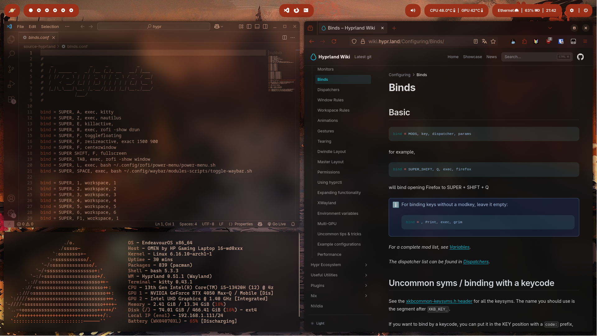

# Hyprland Configuration

<div align="center">


</div>



## Sommaire

- [Pré-requis](#Pré-requis)
- [Stack Utilisateur](#Stack-Utilisateur)
- [Installation des paquets](#Installation-des-paquets)
- [Arborescence](#Arborescence)

## Pré-requis

- **EndeavourOS** (Arch-based)
- Sans DE — **Hyprland** (Wayland) comme WM

## Stack utilisateur

###### Environnement

- Window Manager - [Hyprland](https://wiki.hyprland.org/)
- Fond d'écran - [Swww](https://github.com/LGFae/swww)
- Bar - [Waybar](https://wiki.archlinux.org/title/Waybar)
- Menu launcher - [Rofi](https://wiki.archlinux.org/title/Rofi)
- Shell - [Bash](https://wiki.archlinux.org/title/Bash)
- Terminal - [Kitty](https://wiki.archlinux.org/title/Kitty)
- Écran de verouillage [Hyprlock](https://archlinux.org/packages/extra/x86_64/hyprlock/)

###### Thèmes

- Palette fond d'écran - [Pywal](https://archlinux.org/packages/extra/any/python-pywal/)
- Firefox palette - [Pywalfox](https://github.com/Frewacom/pywalfox)
- Prompt Shell - [Starship](https://starship.rs/)
- Icones - [Font Awesome](https://archlinux.org/packages/extra/any/ttf-font-awesome/) & [Papirus](https://archlinux.org/packages/extra/any/papirus-icon-theme/)
- Informations système - [Fastfetch](https://archlinux.org/packages/extra/x86_64/fastfetch/)

###### Outils

- Éditeur de texte [Nvim](https://neovim.io/)
- Archive - [Zip](https://man.archlinux.org/man/zip.1.e)
- Gestionnaire de fichiers - [Nautilus](https://archlinux.org/packages/extra/x86_64/nautilus/)
- Calculatrice - [Galculator](https://archlinux.org/packages/extra/x86_64/galculator/)
- Screenshot - [Grim](https://archlinux.org/packages/extra/x86_64/grim/) & [Slurp](https://archlinux.org/packages/extra/x86_64/slurp/) & [WL-Clipboard](https://archlinux.org/packages/extra/x86_64/wl-clipboard/)
- Luminosité - [Brightnessctl](https://archlinux.org/packages/extra/x86_64/brightnessctl/) & [ddcutil](https://archlinux.org/packages/extra/x86_64/ddcutil/)
- Image - [Imv](https://archlinux.org/packages/extra/x86_64/imv/)

## Installation des paquets

L'installation peut être effectuée manuellement en installant tous les paquets nécessaires et en copiant la configuration selon l'arborescence ci-dessous, ou à l'aide du script d'installation (expérimental) qui peut être lancé avec ./install.sh.

Si certain paquet ne passe pas, essayé de les installer avec l'AUR avec ```yay -S "nom du paquet"```

## Arborescence

```
📁 home/
└── 📁 benn/
    ├── 📁 Images/
    │   ├── 📁 Screenshots/
    │   │   └── [...]
    │   └── 📁 Wallpapers/
    │       ├── [...]
    │       └── 📁 preview/
    │           └── [...]
    │
    ├── 📁 .config/
    │   ├── 📁 fastfetch/
    │   ├── 📁 help/
    │   ├── 📁 hypr/
    │   ├── 📁 hyprlock/
    │   ├── 📁 kitty/
    │   ├── 📁 nvim/
    │   ├── 📁 rofi/
    │   ├── 📁 starship/
    │   ├── 📁 wal/
    │   └── 📁 waybar/
    │
    ├── 📄 .bashrc
    └── 📄 .bash_profile
```
